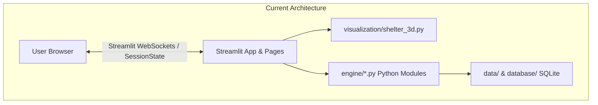
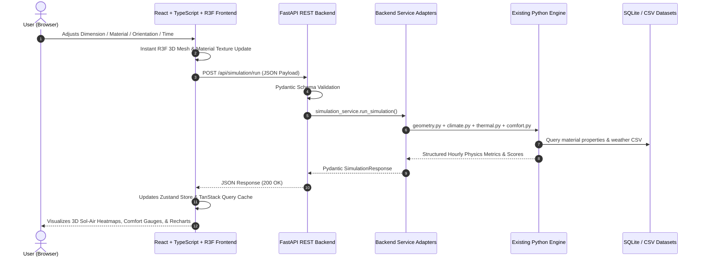

# SHELTERAI — Comprehensive Full-Stack Migration & Architecture Report

> **Platform Mission:** "Software Based Model Development for Design of Area Specific Shelter for Thermal Comfort Maintenance."  
> **Transition:** Streamlit UI $\rightarrow$ Professional Full-Stack Web App (**React + TypeScript + Vite + Three.js / React Three Fiber** $\leftrightarrow$ **FastAPI REST API** $\leftrightarrow$ **Existing Python Physics Engine**).

---

## 1. Current Architecture & State Analysis



### Key Observations:
- The existing platform contains **19 mature Python engineering modules** in `engine/` covering geometry, transient thermal dynamics, ASHRAE 55 / Fanger PMV comfort models, HVAC load estimations, CapEx/OpEx costing, NSGA-II multi-objective optimization, and explainable AI.
- The UI layer currently relies on Streamlit multi-page routing (`pages/01_Home.py` to `pages/08_Results.py`) and Streamlit session state (`st.session_state`).
- The 3D shelter representation previously used Plotly and PyVista. The target full-stack architecture will replace this with a hardware-accelerated **React Three Fiber / Three.js 3D Digital Twin** in the browser, while the backend serves pure, validated mathematical configurations.

---

## 2. Streamlit Pages Audit

| Page File | Purpose | Inputs | Backend Engine Functions | Outputs & Charts |
|---|---|---|---|---|
| `app.py` / `01_Home.py` | Platform overview, global initialization, pipeline routing | User navigation selection | `initialize_auto_location()`, `render_location_sidebar_widget()` | Pipeline cards, system metrics |
| `02_Location.py` | Location selection, live GPS geocoding, climate dataset ingestion | City selection, GPS coords, custom CSV upload | `load_climate_dataset()`, `validate_climate_data()`, `get_city_database()` | Climate zone badges, peak summer/winter metrics, climate data table |
| `03_Climate_Intelligence.py` | Micro-climate diagnostics, extreme stress scenarios, diurnal trends | Selected month / location | `load_climate_dataset()`, `calculate_psychrometrics()`, `calculate_degree_days()` | 30-day temperature profile, solar GHI area chart, extreme heat scenarios |
| `04_Design_Lab.py` | Parametric shelter definition, occupancy sizing, envelope assemblies | $L, W, H$, roof type, pitch, wall mat, thickness, WWR, overhang, orientation | `ShelterGeometry`, `get_materials_catalog()`, `calculate_assembly_u_value()` | Structural summary ($A, V, S/V$, U-value), live 3D blueprint preview |
| `05_Digital_Twin.py` | Multi-physics 3D Digital Twin, solar astronomy, thermal heatmaps, ventilation | Simulation hour (0-23h), view mode, camera preset, component filters | `simulate_shelter_thermal_dynamics()`, `calculate_solar_position()`, `calculate_pmv_fanger()`, `get_material_colors()` | Interactive 3D Digital Twin, solar altitude/azimuth telemetry, thermal comfort gauges |
| `06_Optimization.py` | NSGA-II multi-objective design space search (Comfort vs Cost vs Carbon) | Weights ($w_{\text{comfort}}, w_{\text{cost}}, w_{\text{carbon}}$), pop size | `run_pareto_optimization()`, `get_climate_profile()` | 3D interactive Pareto Front scatter plot, non-dominated candidate rankings |
| `07_What_If_Lab.py` | Side-by-side parametric sensitivity & retrofit comparator | Baseline vs Modified material/insulation configurations | `compare_thermal_scenarios()`, `ShelterGeometry`, `get_climate_profile()` | Diurnal temperature trajectory comparison, avoided discomfort hours |
| `08_Results.py` | Top 4 recommended designs, XAI rationale narratives, certified PDF export | Optimization output / current design | `evaluate_human_comfort()`, `calculate_shelter_cost_and_carbon()`, `generate_design_explanation()`, `generate_pdf_report()` | Top 4 Cards (Balanced, Comfort, Low Energy, Low Cost), Decision Matrix, XAI radar & narrative |

---

## 3. Engineering Engine Modules Review

All 19 Python modules in `engine/` are mathematically verified, contain zero UI dependencies, and will be **directly reused without rewriting calculations**:

| Module | Core Functions | Input Arguments | Output Data | Direct Reuse Status |
|---|---|---|---|---|
| `engine/geometry.py` | `ShelterGeometry`, `from_occupants()`, `generate_design_variants()` | $L, W, H$, roof type, pitch, wall thickness, WWR, overhang, orientation | Envelope areas ($A_{\text{floor}}, A_{\text{wall}}, A_{\text{roof}}$), Volume ($V$), $S/V$ ratio, shading factor | ✅ 100% Reusable Source of Truth |
| `engine/climate.py` | `load_climate_dataset()`, `get_climate_profile()`, `calculate_psychrometrics()`, `calculate_degree_days()` | Location ID, month, weather records | 24-hr & annual hourly records (dry bulb $T$, RH, GHI solar, wind speed/dir) | ✅ 100% Reusable Source of Truth |
| `engine/climate_intelligence.py` | `analyze_climate_intelligence()` | Climate DataFrame, baseline params | Extreme weather anomalies, heat wave alerts, psychrometric comfort bands | ✅ 100% Reusable Source of Truth |
| `engine/extreme_analysis.py` | `run_extreme_stress_analysis()` | Climate records, geometry, envelope | Thermal survivability hours during grid failure / extreme heat waves | ✅ 100% Reusable Source of Truth |
| `engine/geolocation.py` | `get_city_database()`, `reverse_geocode()`, `get_nearest_city()` | Lat/Lon or City ID | City metadata, climate classification, solar irradiance presets | ✅ 100% Reusable Source of Truth |
| `engine/materials.py` | `get_materials_catalog()`, `get_material_by_id()`, `calculate_assembly_u_value()` | Material ID, layer thickness (cm), insulation ID & thickness | $U$-value ($\text{W/m}^2\text{K}$), $R$-value, effective thermal mass ($\text{kJ/m}^2\text{K}$), cost, carbon | ✅ 100% Reusable Source of Truth |
| `engine/thermal.py` | `simulate_shelter_thermal_dynamics()`, `compare_thermal_scenarios()` | `ShelterGeometry`, wall/roof/glazing/insulation IDs & thicknesses, climate records, occupants | 24-hr hourly $T_{\text{indoor}}$, $T_{\text{sol-air}}$, component heat fluxes ($Q_{\text{roof}}, Q_{\text{wall}}, Q_{\text{solar}}, Q_{\text{vent}}, Q_{\text{internal}}$) in Watts | ✅ 100% Reusable Source of Truth |
| `engine/comfort.py` | `calculate_pmv_fanger()`, `get_comfort_category()`, `evaluate_human_comfort()`, `evaluate_livestock_comfort()`, `evaluate_storage_suitability()` | $T_{\text{indoor}}$, RH, air velocity, metabolic rate, clothing insulation | PMV index, PPD %, thermal comfort compliance %, THI (livestock), shelf-life risk (storage) | ✅ 100% Reusable Source of Truth |
| `engine/energy.py` | `calculate_annual_energy_loads()`, `calculate_hourly_hvac_power()` | Geometry, materials, climate records, setpoints | Cooling load ($\text{kWh/yr}$), Heating load, peak electrical power ($\text{kW}$), passive autonomy ratio | ✅ 100% Reusable Source of Truth |
| `engine/cost.py` | `calculate_shelter_cost_and_carbon()`, `calculate_life_cycle_cost()` | Geometry, wall/roof/insulation specs | Capital cost ($\text{INR } ₹$), Embodied Carbon ($\text{kg CO}_2\text{e}$), 20-year LCC with energy escalation | ✅ 100% Reusable Source of Truth |
| `engine/optimizer.py` | `run_pareto_optimization()`, `evaluate_design_candidate()` | Objective weights ($w_{\text{comfort}}, w_{\text{cost}}, w_{\text{carbon}}$), climate records, population size | Pareto front non-dominated solutions, Top 4 recommended candidates, trade-off curves | ✅ 100% Reusable Source of Truth |
| `engine/scoring.py` | `calculate_holistic_shelter_score()` | Thermal comfort %, annual energy, CapEx cost, resilience score | Holistic composite shelter score (0–100) | ✅ 100% Reusable Source of Truth |
| `engine/explainability.py` | `generate_design_explanation()` | Selected design, baseline design, climate zone | Transparent human-readable XAI justifications, trade-off explanations | ✅ 100% Reusable Source of Truth |
| `engine/digital_twin.py` | `generate_digital_twin_telemetry()` | Geometry, materials, solar position, simulation result | Geometric bounding boxes, component vertices, solar vectors, airflow streamlines | ✅ 100% Reusable Source of Truth |
| `engine/material_recommender.py`| `rank_materials_for_climate()` | Climate zone, priority weights | Ranked list of climate-optimal envelope materials | ✅ 100% Reusable Source of Truth |
| `engine/passive_design.py` | `generate_passive_rules()` | Climate zone, orientation | Recommended overhang depths, minimum WWR, cross-ventilation rules | ✅ 100% Reusable Source of Truth |
| `engine/resilience.py` | `calculate_thermal_resilience()` | Simulation results during blackout | Passive survivability hours, thermal lag decay | ✅ 100% Reusable Source of Truth |
| `engine/scenario.py` | `run_scenario_matrix()` | Design variations | Sensitivity matrices for parametric exploration | ✅ 100% Reusable Source of Truth |

---

## 4. Data Flow Architecture

### Current Flow (Streamlit Monolith):
```
[User Form / Slider]
       │
       ▼
[Streamlit Component Rerun]
       │
       ▼
[Python Engine Function]
       │
       ▼
[st.session_state & Plotly/PyVista Rendering]
```

### New Target Flow (Decoupled Full-Stack Architecture):


---

## 5. Target Full-Stack Directory Layout

```
shelter-ai/
├── backend/
│   ├── main.py                     # FastAPI application entrypoint & CORS
│   ├── core/
│   │   ├── config.py               # Environment settings (Pydantic Settings)
│   │   └── logging.py              # Structured logging
│   ├── schemas/                    # Pydantic Request/Response models
│   │   ├── climate.py
│   │   ├── design.py
│   │   ├── material.py
│   │   ├── simulation.py
│   │   ├── optimization.py
│   │   └── digital_twin.py
│   ├── services/                   # Service adapters to engine/
│   │   ├── climate_service.py
│   │   ├── design_service.py
│   │   ├── material_service.py
│   │   ├── simulation_service.py
│   │   ├── optimization_service.py
│   │   └── digital_twin_service.py
│   ├── api/
│   │   ├── router.py               # Root API router (/api/v1)
│   │   └── routes/
│   │       ├── climate.py
│   │       ├── designs.py
│   │       ├── materials.py
│   │       ├── simulation.py
│   │       ├── optimization.py
│   │       ├── results.py
│   │       └── digital_twin.py
│   └── tests/                      # Pytest API integration tests
│
├── engine/                         # UNTOUCHED Python Engineering Source of Truth
│   ├── geometry.py
│   ├── climate.py
│   ├── materials.py
│   ├── thermal.py
│   ├── comfort.py
│   ├── energy.py
│   ├── cost.py
│   ├── optimizer.py
│   ├── scoring.py
│   └── ... (all 19 modules)
│
├── frontend/
│   ├── package.json
│   ├── vite.config.ts
│   ├── tsconfig.json
│   ├── tailwind.config.js / index.css
│   ├── public/
│   │   └── textures/               # Procedural / PBR textures (brick, concrete, wood, metal, glass)
│   ├── src/
│   │   ├── main.tsx
│   │   ├── App.tsx
│   │   ├── types/                  # Strict TypeScript interfaces matching backend Pydantic
│   │   ├── api/                    # Typed Axios/Fetch client & query hooks
│   │   ├── store/                  # Zustand client state (selected design, camera, filters)
│   │   ├── components/
│   │   │   ├── layout/             # Sidebar, Header, PageContainer
│   │   │   ├── ui/                 # MetricCard, Card, Slider, Select, Badge, Button
│   │   │   └── digitalTwin/        # React Three Fiber 3D Canvas
│   │   │       ├── DigitalTwinCanvas.tsx
│   │   │       ├── ShelterScene.tsx
│   │   │       ├── ParametricShelter.tsx
│   │   │       ├── WallsMesh.tsx
│   │   │       ├── RoofMesh.tsx
│   │   │       ├── GlazingMesh.tsx
│   │   │       ├── SunAndSolarPath.tsx
│   │   │       ├── CompassOverlay.tsx
│   │   │       └── MaterialLibrary.ts
│   │   └── pages/                  # React views replacing Streamlit pages
│   │       ├── HomePage.tsx
│   │       ├── LocationClimatePage.tsx
│   │       ├── ClimateIntelligencePage.tsx
│   │       ├── ShelterDesignLabPage.tsx
│   │       ├── DigitalTwinPage.tsx
│   │       ├── OptimizationPage.tsx
│   │       ├── WhatIfLabPage.tsx
│   │       └── ResultsPage.tsx
│
├── data/                           # materials.csv, sample_designs.json, climate datasets
├── database/                       # schema.sql, seed.py, SQLite database
└── requirements.txt                # FastAPI, Uvicorn, Pydantic, ReportLab, etc.
```

---

## 6. Migration Execution Plan

1. **Backend Foundation (`backend/`)**:
   - Build FastAPI app with CORS, health check, and structured error handlers.
   - Define strict Pydantic schemas for Geometry, Climate, Materials, Simulation, Optimization, and Digital Twin.
   - Build service adapters that bridge Pydantic models directly into `engine/*.py` modules.
   - Test endpoints with Pytest to guarantee 100% calculation parity.

2. **Frontend Foundation (`frontend/`)**:
   - Initialize Vite + React + TypeScript in `frontend/`.
   - Setup TailwindCSS/modern engineering dark theme, Lucide icons, and React Router.
   - Build reusable component library (`MetricCard`, `Card`, `Slider`, `Select`, `Button`, `Badge`).
   - Create typed API client with Axios and Zustand store.

3. **Parametric React Three Fiber Digital Twin**:
   - Implement `DigitalTwinCanvas` with OrbitControls, directional sun lighting linked to NOAA calculations, diurnal solar spline curve, dynamic ground shadow, and 3D Cardinal compass.
   - Build parametric 3D meshes (Pitched gable with triangular walls, Monoslope shed, Hipped, Flat slab, parametric glazed panes, door, overhang eaves).
   - Implement material PBR mappings and real-time Sol-Air thermal scalar coloring.

4. **Page Implementations & Integration**:
   - Migrate all 8 functional pages into modern, interactive React views.
   - Verify that changing dimensions, materials, climate locations, or running Pareto optimizations updates both the backend physics calculations and the 3D Digital Twin immediately.

5. **Final Testing & Verification**:
   - Run end-to-end integration tests verifying numerical consistency between the original Python engine and the full-stack app.
